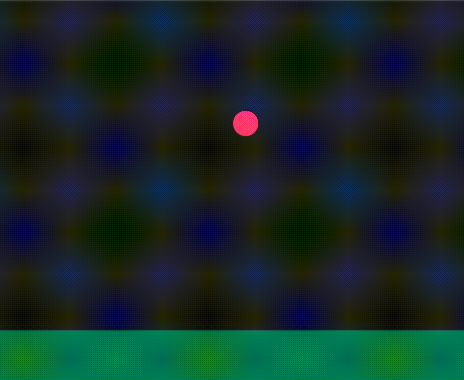

# 2Web Kit - Animations

Vsynced animations that debounces double enqueues.

## Usage

```ts
import { animate, Timeline } from "@two-web/kit/animations";

const animationTarget = document.getElementById("ball");

const height = 400;
let progress = 0;
function bounce() {
  const y = Math.abs(Math.sin(progress * Math.PI)) * height;
  animationTarget.style.transform = `translateY(-${y}px)`;

  progress += 0.01;
}

const timeline = new Timeline(() => {
  // Notice that although we perform 16 calls to `animate` per frame
  // (assuming 60fps), the animation callback is only invoked once per
  // frame, because the values are debounced per animation identifier.
  animate(bounce);
});

timeline.start();
```



### Animation Identifiers

Animation identifiers can be used for complex animations that might have
multiple different callers or go across multiple component boundaries.

```ts
import { animation, animate, Timeline } from "@two-web/kit/animations";

const moveAnimation = animation("move");

function move() {
  // Do something
}

const timeline = new Timeline(() => {
  animate(move, moveAnimation);
});

timeline.start();
```
